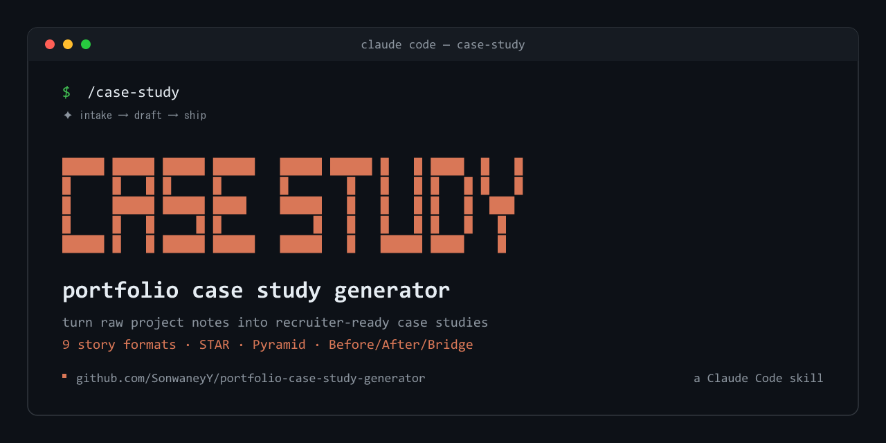

# Portfolio Case Study Generator — A Claude Code Skill for Designers

> Generate recruiter-ready portfolio case studies from raw project notes. A Claude Code skill that turns messy UX, product, and design work into structured, compelling case studies in 9 story formats.

Turn raw project notes into polished design case studies that tell the story of your process, decisions, and impact. Built as a [Claude Code skill](https://docs.anthropic.com/en/docs/claude-code) you can drop into your `~/.claude/skills/` folder and invoke on demand. Works for portfolio sites, interview walkthroughs, and case study presentations.

## Why this skill?

Most designers know their work is strong but freeze up when it's time to write about it. Case studies end up either too thin (just screenshots) or too long (every Figma iteration documented). This skill gives Claude the structure, tone, and storytelling conventions that top portfolios use — so you can go from messy project notes to a scannable, hire-worthy case study in one pass.

**Good for:**
- Product designers assembling a portfolio
- UX designers preparing interview case study walkthroughs
- Design leads documenting work for internal showcases
- Freelancers writing client-ready project recaps

## What's inside

| File | Purpose |
|---|---|
| `SKILL.md` | The skill definition Claude loads — structure, writing tips, best practices |
| `PROJECT-TEMPLATE.md` | A fill-in-the-blank template for a single case study |
| `design-portfolio-guide.md` | Broader guidance for assembling a portfolio of case studies |
| `slide-template.md` | Presentation-deck layout for walking through a case study live |
| `tone-guide.md` | Voice and tone conventions — first-person, specific, quantified |
| `references.md` | Reference links and exemplars |

## The case study structure

Every case study produced by this skill follows a six-part arc:

1. **Overview** — role, timeline, hook metric
2. **Challenge** — business context, user pain, constraints
3. **Process** — research, ideation, key decisions, iteration
4. **Solution** — final design walkthrough and rationale
5. **Impact** — quantitative and qualitative results
6. **Reflection** — learnings and what you'd do differently

## Story formats

The default six-part arc above is a strong baseline, but not every project fits the same shape. A bold redesign reads differently from a quiet usability fix; an interview walkthrough sounds different from a blog post. This skill can re-structure the same source material into whichever narrative format best serves your audience:

| Format | Best for | Shape |
|---|---|---|
| **STAR** (Situation, Task, Action, Result) | Interview prep, recruiter scans | Tight, outcome-led, four crisp beats |
| **Hero's Journey** | Long-form portfolio pieces | Status quo → call to adventure → trials → transformation |
| **Problem → Solution → Impact** | Product design portfolios | Three-act, business-flavored |
| **Before / After / Bridge** | Redesign and migration projects | Pain state → vision state → how you bridged it |
| **Pyramid Principle** | Executive readouts, exec portfolios | Lead with the answer, then evidence, then detail |
| **Pixar "Once upon a time…"** | Storytelling-forward decks | Once upon a time / every day / one day / because of that / until finally |
| **Three-Act Structure** | Conference talks, live walkthroughs | Setup → confrontation → resolution |
| **Jobs-to-be-Done narrative** | Strategy-led portfolios | When… I want to… so I can… |
| **Decision Log** | Systems and platform work | A chronological chain of key decisions and their tradeoffs |

Just tell the skill which one you want:

```
Use the case-study skill to write my checkout redesign as a Before/After/Bridge story
```

```
/case-study — format it as STAR for an interview loop
```

The skill will preserve your facts, role, and metrics while reshaping the arc, headings, and pacing to match the chosen format.

## Installation

### Option 1: Drop it into your Claude skills folder

```bash
git clone https://github.com/SonwaneyY/portfolio-case-study-generator.git ~/.claude/skills/case-study
```

On Windows:

```powershell
git clone https://github.com/SonwaneyY/portfolio-case-study-generator.git "$env:USERPROFILE\.claude\skills\case-study"
```

Claude Code will auto-discover the skill on next launch.

### Option 2: Use it as a standalone template

Clone the repo anywhere and copy `PROJECT-TEMPLATE.md` into your portfolio project. Fill it in manually or feed it to any LLM with `SKILL.md` as the system prompt.

## Usage

Once installed as a Claude Code skill, just ask:

```
Use the case-study skill
```

Or invoke it directly:

```
/case-study
```

### What happens next

The skill runs a **structured intake before drafting anything**. It will ask you 7 questions in a single message:

1. The project in one sentence
2. Project type (consumer app, B2B, redesign, design system, 0→1, etc.)
3. Your role and team
4. Audience (recruiter scan, interview loop, portfolio site, exec readout, conference talk, blog post)
5. Story format — pick one of the 9 formats above, or say "unsure" and the skill will recommend one based on your project type and audience
6. Your hook (the most impressive outcome)
7. Raw material you have (notes, Figma links, metrics, quotes, transcripts)

Only after you answer does it draft. The result follows the format-specific beats and pacing for whichever shape you chose, preserves your facts and metrics (it will not invent numbers), and ends by offering to tighten, lengthen, reformat for a specific destination, or generate a second variant in a different format for comparison.

If you've already given the skill some of this context in your opening message, it skips those questions and only asks the rest.

## Writing principles this skill enforces

- **First person for your contributions** — be specific about your role vs. the team
- **Lead with the most impressive outcome** — the hook wins attention
- **Show process, don't document every step** — highlight insight moments and pivots
- **Quantify impact** wherever possible
- **Edit ruthlessly** — shorter is better

## Contributing

Issues and PRs welcome. If you've shipped a portfolio using this skill and have improvements — tone tweaks, new sections, better templates — open a PR.

## License

MIT

## Related

- [Claude Code](https://docs.anthropic.com/en/docs/claude-code) — the CLI this skill plugs into
- [Anthropic Skills](https://docs.anthropic.com/en/docs/claude-code/skills) — official skill documentation

---

**Keywords:** portfolio case study generator, claude code skill, design case study, ux case study, product design portfolio, portfolio template, case study writing, design storytelling, interview case study, claude ai skill, design portfolio generator
